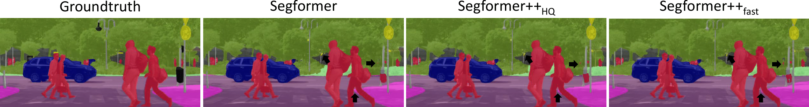
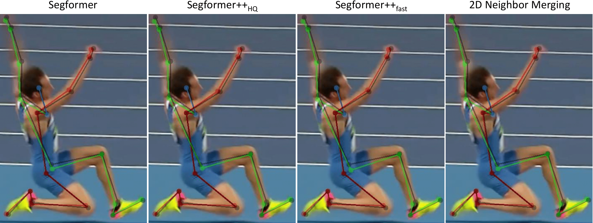

# SegFormer++

Paper: [Segformer++: Efficient Token-Merging Strategies for High-Resolution Semantic Segmentation](https://arxiv.org/abs/2405.14467)





## Abstract

Utilizing transformer architectures for semantic segmentation of high-resolution images is hindered by the attention's quadratic computational complexity in the number of tokens. A solution to this challenge involves decreasing the number of tokens through token merging, which has exhibited remarkable enhancements in inference speed, training efficiency, and memory utilization for image classification tasks. In this paper, we explore various token merging strategies within the framework of the SegFormer architecture and perform experiments on multiple semantic segmentation and human pose estimation datasets. Notably, without model re-training, we, for example, achieve an inference acceleration of 61% on the Cityscapes dataset while maintaining the mIoU performance. Consequently, this paper facilitates the deployment of transformer-based architectures on resource-constrained devices and in real-time applications.

**Update:** It is now possible to load the model via torch.hub. See [here](docs/setup/torchhub_setup.md).

**Update:** It is now possible to run the model **without OpenMMLab dependencies**, enabling users to utilize the SegFormerPlusPlus architecture without installing the full OpenMMLab framework.

## Results and Models

Memory refers to the VRAM requirements during the training process.

### Inference on Cityscapes (MiT-B5)

The weights of the Segformer (Original) model were used to get the inference results.

| Method                            |  mIoU | Speed-Up | config                                                                                     | download                                                       |
|-----------------------------------|------:|---------:|--------------------------------------------------------------------------------------------|----------------------------------------------------------------|
| Segformer (Original)              | 82.39 |        - | [config](mmsegmentation/local_configs/cityscapes/B5/segformer-cityscapes-b5-default.py)    | [model](https://mediastore.rz.uni-augsburg.de/get/yzE65lzm6N/) |
| Segformer++<sub>HQ</sub> (ours)   | 82.31 |     1.61 | [config](mmsegmentation/local_configs/cityscapes/B5/segformer-cityscapes-b5-bsm-hq.py)     | [model](https://mediastore.rz.uni-augsburg.de/get/yzE65lzm6N/) |
| Segformer++<sub>fast</sub> (ours) | 82.04 |     1.94 | [config](mmsegmentation/local_configs/cityscapes/B5/segformer-cityscapes-b5-bsm-fast.py)   | [model](https://mediastore.rz.uni-augsburg.de/get/yzE65lzm6N/) |
| Segformer++<sub>2x2</sub> (ours)  | 81.96 |     1.90 | [config](mmsegmentation/local_configs/cityscapes/B5/segformer-cityscapes-b5-n2d-2x2.py)    | [model](https://mediastore.rz.uni-augsburg.de/get/yzE65lzm6N/) |
| Segformer (Downsampling)          | 77.31 |     6.51 | [config](mmsegmentation/local_configs/cityscapes/B5/segformer-cityscapes-b5-downsample.py) | [model](https://mediastore.rz.uni-augsburg.de/get/yzE65lzm6N/) |

### Training on Cityscapes (MiT-B5)

| Method                            |  mIoU | Speed-Up | Memory (GB) | config                                                                                     | download                                                        |
|-----------------------------------|------:|---------:|-------------|--------------------------------------------------------------------------------------------|-----------------------------------------------------------------|
| Segformer (Original)              | 82.39 |        - | 48.3        | [config](mmsegmentation/local_configs/cityscapes/B5/segformer-cityscapes-b5-default.py)    | [model](https://mediastore.rz.uni-augsburg.de/get/yzE65lzm6N/)  |
| Segformer++<sub>HQ</sub> (ours)   | 82.19 |     1.40 | 34.0        | [config](mmsegmentation/local_configs/cityscapes/B5/segformer-cityscapes-b5-bsm-hq.py)     | [model](https://mediastore.rz.uni-augsburg.de/get/i8fY8uXJrV/ ) |
| Segformer++<sub>fast</sub> (ours) | 81.77 |     1.55 | 30.5        | [config](mmsegmentation/local_configs/cityscapes/B5/segformer-cityscapes-b5-bsm-fast.py)   | [model](https://mediastore.rz.uni-augsburg.de/get/cmG974iAxt/ ) |
| Segformer++<sub>2x2</sub> (ours)  | 82.38 |     1.63 | 31.1        | [config](mmsegmentation/local_configs/cityscapes/B5/segformer-cityscapes-b5-n2d-2x2.py)    | [model](https://mediastore.rz.uni-augsburg.de/get/p0uMKbw531/)  |
| Segformer (Downsampling)          | 79.24 |     2.95 | 10.0        | [config](mmsegmentation/local_configs/cityscapes/B5/segformer-cityscapes-b5-downsample.py) | [model](https://mediastore.rz.uni-augsburg.de/get/73zkKSO21t/)  |

### Training on ADE20K (640x640) (MiT-B5)

| Method                            |  mIoU | Speed-Up | Memory (GB) | config                                                                                | download                                                       |
|-----------------------------------|------:|---------:|------------:|---------------------------------------------------------------------------------------|----------------------------------------------------------------|
| Segformer (Original)              | 49.72 |        - |        33.7 | [config](mmsegmentation/local_configs/ade20k/B5/segformer-ade20k640-b5-default.py)    | [model](https://mediastore.rz.uni-augsburg.de/get/nKEjUHNAfK/) |
| Segformer++<sub>HQ</sub> (ours)   | 49.77 |     1.15 |        29.2 | [config](mmsegmentation/local_configs/ade20k/B5/segformer-ade20k640-b5-bsm-hq.py)     | [model](https://mediastore.rz.uni-augsburg.de/get/Odyie8usgj/) |
| Segformer++<sub>fast</sub> (ours) | 49.10 |     1.20 |        28.0 | [config](mmsegmentation/local_configs/ade20k/B5/segformer-ade20k640-b5-bsm-fast.py)   | [model](https://mediastore.rz.uni-augsburg.de/get/K0IGkx4O2s/) |
| Segformer++<sub>2x2</sub> (ours)  | 49.35 |     1.26 |        27.2 | [config](mmsegmentation/local_configs/ade20k/B5/segformer-ade20k640-b5-n2d-2x2.py)    | [model](https://mediastore.rz.uni-augsburg.de/get/w5_Pxx4Q5C/) |
| Segformer (Downsampling)          | 46.71 |     1.89 |        12.4 | [config](mmsegmentation/local_configs/ade20k/B5/segformer-ade20k640-b5-downsample.py) | [model](https://mediastore.rz.uni-augsburg.de/get/dFVvZQL6iL/) |

### Training on JBD

| Method                            | PCK@0.1 | PCK@0.05 | Speed-Up | Memory (GB) | config                                                              | download                                                       |
|-----------------------------------|--------:|---------:|---------:|------------:|---------------------------------------------------------------------|----------------------------------------------------------------|
| Segformer (Original)              |   95.20 |    90.65 |        - |        40.0 | [config](mmpose/local_configs/jbd/B5/segformer-jump-b5-default.py)  | [model](https://mediastore.rz.uni-augsburg.de/get/psolrWXLLp/) |
| Segformer++<sub>HQ</sub> (ours)   |   95.18 |    90.51 |     1.19 |        36.0 | [config](mmpose/local_configs/jbd/B5/segformer-jump-b5-bsm-hq.py)   | [model](https://mediastore.rz.uni-augsburg.de/get/jx1eyecMLF/) |
| Segformer++<sub>fast</sub> (ours) |   94.58 |    89.87 |     1.25 |        34.6 | [config](mmpose/local_configs/jbd/B5/segformer-jump-b5-bsm-fast.py) | [model](https://mediastore.rz.uni-augsburg.de/get/K0IGkx4O2s/) |
| Segformer++<sub>2x2</sub> (ours)  |   95.17 |    90.16 |     1.27 |        33.4 | [config](mmpose/local_configs/jbd/B5/segformer-jump-b5-n2d-2x2.py)  | [model](https://mediastore.rz.uni-augsburg.de/get/HumKbSB1vI/) |

### Training on MS COCO

| Method                            | PCK@0.1 | PCK@0.05 | Speed-Up | Memory (GB) | config                                                               | download                                                       |
|-----------------------------------|--------:|---------:|---------:|------------:|----------------------------------------------------------------------|----------------------------------------------------------------|
| Segformer (Original)              |   95.16 |    87.61 |        - |        13.5 | [config](mmpose/local_configs/coco/B5/segformer-coco-b5-default.py)  | [model](https://mediastore.rz.uni-augsburg.de/get/ZOgj2NmQLy/) |
| Segformer++<sub>HQ</sub> (ours)   |   94.97 |    87.35 |     0.97 |        13.1 | [config](mmpose/local_configs/coco/B5/segformer-coco-b5-bsm-hq.py)   | [model](https://mediastore.rz.uni-augsburg.de/get/oAH5IlPxG8/) |
| Segformer++<sub>fast</sub> (ours) |   95.02 |    87.37 |     0.99 |        12.9 | [config](mmpose/local_configs/coco/B5/segformer-coco-b5-bsm-fast.py) | [model](https://mediastore.rz.uni-augsburg.de/get/3E2mMNLAAn/) |
| Segformer++<sub>2x2</sub> (ours)  |   94.98 |    87.36 |     1.24 |        12.3 | [config](mmpose/local_configs/coco/B5/segformer-coco-b5-n2d-2x2.py)  | [model](https://mediastore.rz.uni-augsburg.de/get/rzlgKC5XLc/) |

## Usage

To use our models for semantic segmentation or 2D human pose estimation, please follow the installation instructions for MMSegmentation and MMPose respectively, which can be found in the documentation of the respective repositories.

- [Use the SegFormer++ with MMSegmentation](docs/setup/mmseg_setup.md)
- [Use the SegFormer++ with MMPose](docs/setup/mmpose_setup.md)
- [Use the SegFormer++ without MMSegmentation/MMPose](docs/setup/mmeng_setup.md)
- [Use the SegFormer++ without OpenMMLab](docs/setup/noopenmmlab_setup.md)
- [Token Merging Settings](docs/run/token_merging.md)

## Citation
```bibtex
@article{kienzle2024segformer++,
  title={Segformer++: Efficient Token-Merging Strategies for High-Resolution Semantic Segmentation},
  author={Kienzle, Daniel and Kantonis, Marco and Sch{\"o}n, Robin and Lienhart, Rainer},
  journal={IEEE International Conference on Multimedia Information Processing and Retrieval (MIPR)},
  year={2024}
}
```
